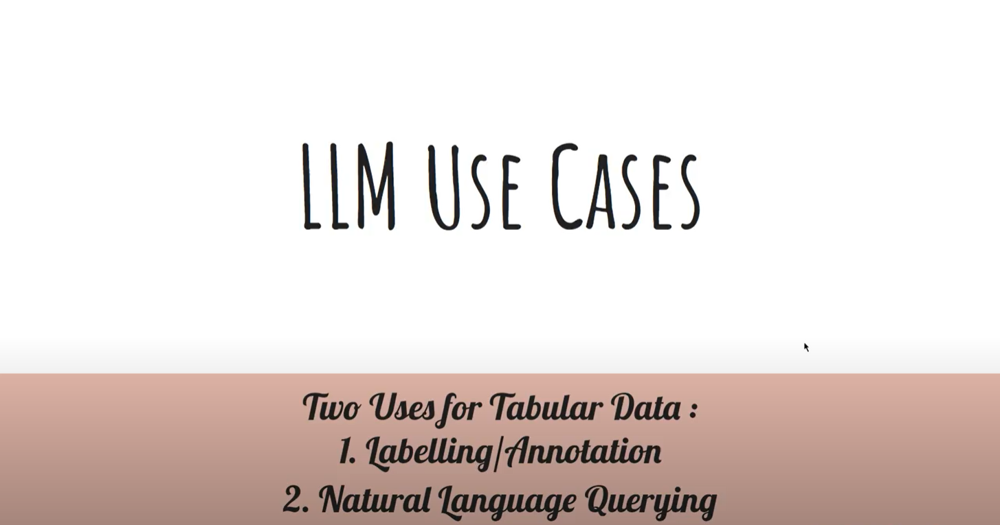

## LLM Use Cases

Two use cases on LLM (Large Language Models) have been developed here. Both of them run on tabular data. Watch the video link below for clearer understanding.
1. Labelling/Annotation
2. Natural Language Querying
[](https://youtu.be/voQPdIdZ0xA)

## Getting Started
The application is built up upon the streamlit app and written in python only. Upon installation, the app can be run and used. Notebooks in the /notebooks/ directory are not guranteed to run and are mostly used for experimentation only.

### Prerequistes
1. Register and get an openAI key
    * <a href="https://www.howtogeek.com/885918/how-to-get-an-openai-api-key/"> Link here</a>

2. Tested on python 3.10.6 / Windows environment

### Installation
* (Optional) If using virtual environments.
    ```sh
    python -m venv .myenv
     .\.myenv\Scripts\activate
    ```
1. Install requirements.txt
    ```sh
    pip install -r requirements.txt
    ```
2. Create src\apikey.py file as below
    ```
    apikey = 'youropenaikey'
    ```
3. Run App
    ```sh
    cd src
    streamlit run UI_app.py 
    ```
### Usage
- Use Case 1 : Labelling Tabular Data
     1. Load data/fruits_raw_sample.csv
     2. Input the Label you want (Color/USD per kg)
     3. Also able to edit the Fruit column.
     * Limitations
     1. Currently, only accepts files with 5 rows at most only
     2. Also only uses the first column for labelling.

- Use Case 2 : Natural Language Querying
    1. Load data/fruits_raw.csv
    2. Selected file will uploaded directly to sqlite db
    3. Simple Data Manipulation (Excel-like)
        * Click the sorting asc/desc button
        * Filter the column/(s) using one or multiple values
    4. Complex Data Manipulation
        * SQL like data manipulation
        ```txt
        Sample Queries: 
        1. Find fruits which have higher fibre than the average and lower sugar than the average ? Also display their fibre and sugar
        2. Segment and count the number of fruits per Season and Shape ?
        ```
        * Click ChatGPT Query button

### Roadmap
1. Labelling Tabular Data use case :
    * Able to select multiple columns to be used as reference for labelling
    * Few Shot learning (like labelling a few rows of data to aid ChatGPT)
2. Natural Language Querying :
    * Test with non-tech person written queries
    * My queries might be biased.
3. Integration with Darc.
3. Other use cases, please feel free to suggest.

     


